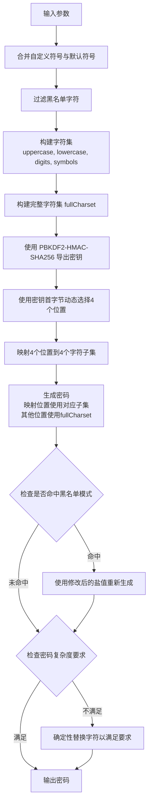

# Vault Architect - Deterministic Password Generator

一个安全、确定性的密码生成器，能够根据相同的输入（token + salt + 参数）在不同设备上生成相同的密码。

## 核心逻辑

### 密码生成算法

密码生成采用以下确定性算法：

```
输入: Token (主密码) + Salt (盐值) + Password Length (长度) + Custom Special Characters (自定义特殊字符)
输出: 满足要求的复杂密码
```

### 算法流程



### 密码要求

生成的密码必须满足以下所有条件：

- ✅ **至少 1 个大写字母** (A-Z)
- ✅ **至少 1 个小写字母** (a-z)
- ✅ **至少 1 个数字** (0-9)
- ✅ **至少 1 个特殊字符**

### 密码生成策略

密码通过**动态位置映射**生成，提高安全性：

**算法流程：**

1. **动态选择4个位置**：根据 `keyBuffer[0]` 的值，从密码的所有位置中随机选择4个唯一位置
2. **映射到4个子集**：这4个位置分别映射到大写字母、小写字母、数字、特殊字符
3. **其他位置**：使用完整字符集（大写+小写+数字+特殊字符）生成

**示例（12字符密码）：**
```
位置:  0  1  2  3  4  5  6  7  8  9 10 11
类型:  全 全 特 全 大 全 小 全 数 全 全
       ↑              ↑     ↑     ↑
       第1个特符号    大写  小写  数字
       在位置2
```

**位置选择公式：**
```javascript
selectedPositions = []
availablePositions = [0, 1, 2, ..., length-1]

for i in [0..3]:
    idx = (keyBuffer[0] + i * 7) % availablePositions.length
    selectedPositions.push(availablePositions[idx])
    availablePositions.splice(idx, 1)

positionMapping[selectedPositions[0]] = uppercase
positionMapping[selectedPositions[1]] = lowercase
positionMapping[selectedPositions[2]] = digits
positionMapping[selectedPositions[3]] = symbols
```

**优势：**
- ✅ 4个关键字符的位置无法预测
- ✅ 每种类型至少1个字符（由 `ensureCriteria` 保证）
- ✅ 其他位置使用全集，最大化熵值
- ✅ 完全确定性，相同输入产生相同输出
- ✅ 比固定位置映射更安全

### 核心组件

#### 1. 字符集构建

```javascript
// 默认特殊字符
DEFAULT_SPECIAL_CHARS = '@#^!?'

// 合并自定义符号与默认符号
mergedSymbols = mergeAndDeduplicate(customSymbols, DEFAULT_SPECIAL_CHARS)

// 过滤黑名单（默认包含空格）
symbols = filterBlacklist(mergedSymbols, blacklist)

// 最终字符集
charset = uppercase + lowercase + digits + symbols
```

**规则：**
- `customSymbols` 不覆盖默认符号，而是合并去重
- 黑名单优先级最高，会从字符集中过滤掉
- 如果过滤后特殊字符少于 1 个，抛出错误

#### 2. 密钥派生 (PBKDF2)

使用 PBKDF2-HMAC-SHA256 算法进行确定性密钥派生：

```javascript
const iterations = 100000;
const derivedKey = crypto.pbkdf2Sync(
    masterPassword,
    salt,
    iterations,
    length * 2,
    'sha256'
);
```

**特点：**
- 确定性：相同输入产生相同输出
- 高安全性：100,000 次迭代防止暴力破解
- 标准算法：使用业界标准的 PBKDF2

#### 3. 密码生成（动态位置映射）

使用动态位置映射策略将密钥映射到字符集：

```javascript
// 使用第一个字符确定4个位置
const firstCharValue = keyBuffer[0];

// 生成4个唯一位置
const selectedPositions = [];
const availablePositions = Array.from({ length }, (_, i) => i);

for (let i = 0; i < 4; i++) {
    const idx = (firstCharValue + i * 7) % availablePositions.length;
    selectedPositions.push(availablePositions[idx]);
    availablePositions.splice(idx, 1);
}

// 映射：positions[0]→大写, positions[1]→小写, positions[2]→数字, positions[3]→符号
const positionMapping = {
    [selectedPositions[0]]: uppercase,
    [selectedPositions[1]]: lowercase,
    [selectedPositions[2]]: digits,
    [selectedPositions[3]]: symbols
};

let bufferIndex = 1;

for (let i = 0; i < length; i++) {
    if (selectedPositions.includes(i)) {
        // 固定位置：从对应子集选择
        const dataset = positionMapping[i];
        const charIndex = keyBuffer[bufferIndex % keyBuffer.length] % dataset.length;
        password += dataset[charIndex];
    } else {
        // 其他位置：从全集选择（最大化熵值）
        const charIndex = keyBuffer[bufferIndex % keyBuffer.length] % fullCharset.length;
        password += fullCharset[charIndex];
    }
    bufferIndex++;
}
```

#### 4. 确定性字符替换（备用）

如果动态映射生成的密码仍不符合要求，会进行确定性替换：

```javascript
// 使用 keyBuffer 作为"随机"源，而非 Math.random()
const getNextRandom = (max) => {
    const value = keyBuffer[bufferIndex % keyBuffer.length];
    bufferIndex++;
    return value % max;
};

// 确定性索引排序（Fisher-Yates shuffle）
for (let i = indices.length - 1; i > 0; i--) {
    const j = keyBuffer[i] % (i + 1);
    [indices[i], indices[j]] = [indices[j], indices[i]];
}
```

**注意：** 动态位置映射通常能满足要求，此机制主要用于确保极端情况下的合规性。

**确定性保证：**
- 不使用 `Math.random()` 或其他非确定性随机数
- 所有随机性来自 PBKDF2 导出的密钥
- 相同输入总是产生相同输出

### 确定性验证

在相同输入条件下：
- Token + Salt + Password Length + Custom Special Characters 完全相同
- **每次生成的密码完全相同**

**测试结果：**
```
============================================================
Running: Test 1: Basic with default symbols
============================================================
Inputs:
  Token:   MySecretToken123
  Salt:    github.com
  Length:  16
  Symbols: ""

✅ PASS: All 10 passwords are identical
   Password: @QEZ!UXf4o7thva?
```

## 使用方法

### Node.js 后端

```javascript
const { generatePassword } = require('./src/password_generator');

// 生成密码
const password = await generatePassword({
    masterPassword: 'MySecretToken123',  // Token
    salt: 'github.com',                    // Salt
    length: 16,                            // 密码长度
    customSymbols: '$%',                   // 自定义特殊字符（可选）
    blacklist: [' ']                       // 黑名单（可选）
});

console.log(password); // 输出确定性密码
```

### Web 前端

打开 `web/index.html`，在浏览器中：

1. 输入 **Your Token**（主密码）
2. 输入 **Salt**（盐值）
3. 选择 **Password Length**（密码长度）
4. （可选）输入 **Custom Special Characters**（自定义特殊字符）
5. 点击 **Generate Secure Password**

所有计算在本地浏览器完成，数据不会离开设备。

## 项目结构

```
.
├── src/
│   └── password_generator.js    # 核心密码生成逻辑
├── web/
│   └── index.html              # Web 前端界面
└── test/
    ├── quick_test.js            # 快速确定性测试
    ├── deterministic_test.js    # 完整测试套件
    └── DETERMINISTIC_TEST.md    # 测试文档
```


## 参数说明

| 参数 | 说明 | 默认值 | 必需 |
|------|------|--------|------|
| `masterPassword` | Token（主密码） | - | ✅ 是 |
| `salt` | 盐值（通常为网站名） | - | ✅ 是 |
| `length` | 密码长度 | 8 | ❌ 否 |
| `customSymbols` | 自定义特殊字符 | `@#^!?` | ❌ 否 |
| `blacklist` | 黑名单字符 | `[' ']` | ❌ 否 |
| `iterations` | PBKDF2 迭代次数 | 100000 | ❌ 否 |

## 安全特性

- ✅ **本地计算**：Web 版本所有计算在浏览器本地完成
- ✅ **不存储数据**：Token 和 Salt 永不存储或传输
- ✅ **确定性**：相同输入产生相同输出，便于跨设备使用
- ✅ **高强度算法**：使用 PBKDF2-HMAC-SHA256，100,000 次迭代
- ✅ **动态位置映射**：4个关键字符位置不可预测，提高安全性
- ✅ **复杂度要求**：强制包含大小写字母、数字和至少 1 个特殊字符

## 许可证

GPLv3

## 作者

by bigfacekitty
